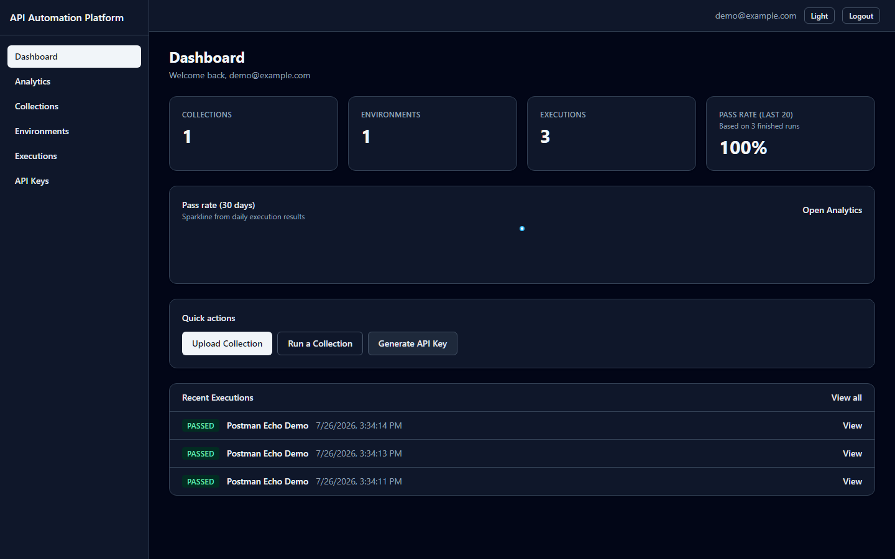
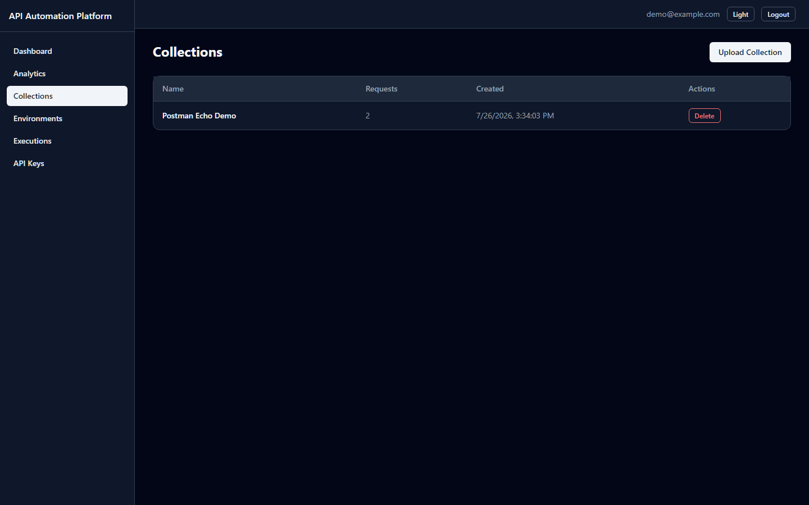
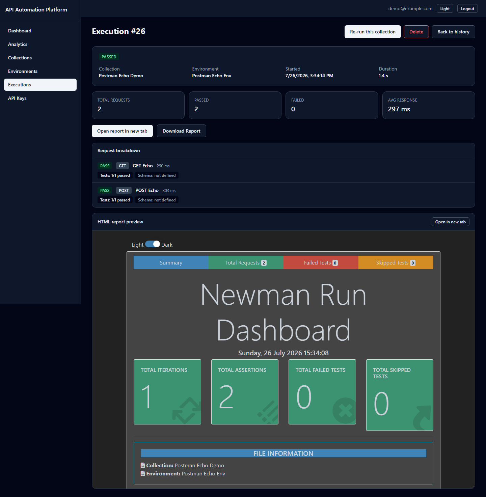
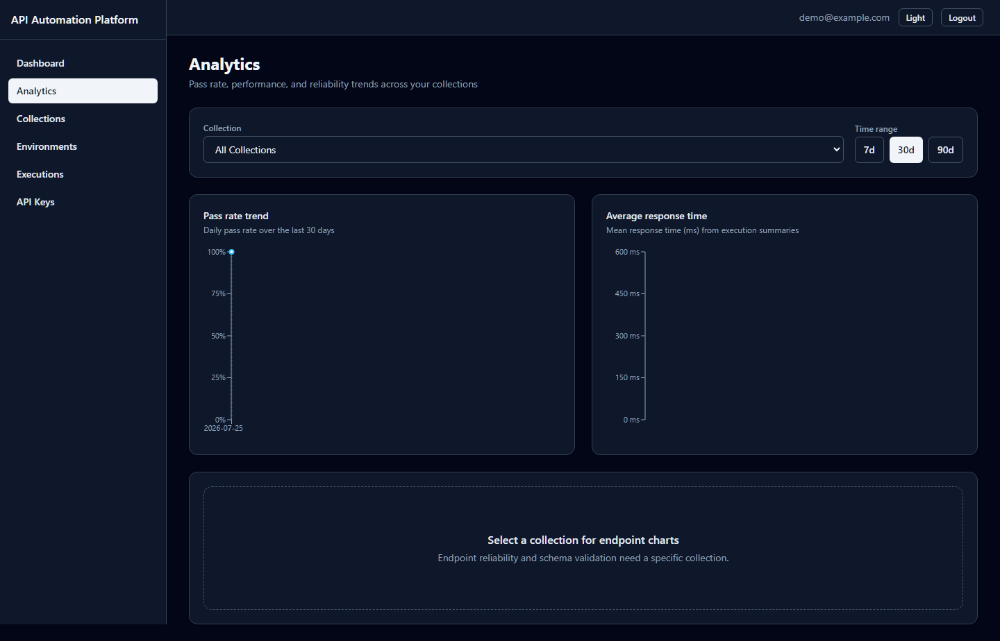

# API Automation Platform

Full-stack platform for automating REST API testing with **Postman collections** and **Newman**.

Upload collections and environments, run tests from the UI or CI (API keys), validate responses with JSON Schema, review execution history and HTML reports, and monitor pass-rate and performance trends on interactive dashboards.

## Tech stack

| Layer | Technology |
|-------|------------|
| Frontend | React (Vite), Tailwind CSS, Recharts, React Router, Axios |
| Backend | Node.js, Express |
| Database | PostgreSQL on Neon (serverless) |
| Test runner | Postman collections + Newman + newman-reporter-htmlextra |
| Validation | JSON Schema (Ajv) |
| CI | GitHub Actions workflow template + API-key execution endpoints |
| Deploy | Frontend → **Vercel**, Backend → **Render**, DB → **Neon** |

## Live demo

| | URL |
|--|-----|
| **Frontend** | [https://api-automation-platform-weld.vercel.app/](https://api-automation-platform-weld.vercel.app/) |
| **Backend** | [https://api-automation-platform.onrender.com/](https://api-automation-platform.onrender.com/) |
| **Health check** | [https://api-automation-platform.onrender.com/health](https://api-automation-platform.onrender.com/health) |

> Free-tier Render services may cold-start; the first request after idle can take ~30–60s.

## Architecture

```
  Browser
     │
     ▼
┌─────────────┐     HTTPS / JSON      ┌──────────────────┐
│   Vercel    │ ───────────────────►  │  Render (Node)   │
│  (React SPA)│ ◄───────────────────  │  Express + Newman│
└─────────────┘   JWT / X-API-Key     └────────┬─────────┘
                                               │
                                               │ SQL (pg)
                                               ▼
                                      ┌──────────────────┐
                                      │  Neon Postgres   │
                                      └──────────────────┘
```

- **Vercel** hosts the Vite SPA (`VITE_API_URL` → Render).
- **Render** serves `/api/*` and `/health`, runs Newman in-process.
- **Neon** stores users, collections, environments, executions, schemas, and API keys.

## Project structure

```
/
├── backend/                 # Express API (Render)
│   ├── scripts/             # seed-demo, seed-executions
│   ├── render.yaml
│   ├── REPORTS.md
│   └── src/
├── frontend/                # React Vite app (Vercel)
│   └── vercel.json          # SPA route rewrites
├── docs/screenshots/        # README UI previews
├── scripts/                 # capture-screenshots helper
├── .github/workflows/       # CI workflow template
├── LICENSE                  # MIT
└── README.md
```

## Screenshots

| Screen | Preview |
|--------|---------|
| Dashboard |  |
| Collections |  |
| Execution detail / report |  |
| Analytics |  |

## Build log (phases)

| Phase | Features delivered | Status |
|-------|-------------------|--------|
| **1. Scaffold** | Monorepo, Express + Vite, Neon pool, health checks, migrations | Done |
| **2. Auth** | JWT register/login/me, protected routes, AuthContext | Done |
| **3. Collections & environments** | Upload/parse Postman JSON, CRUD, ownership checks | Done |
| **4. Newman engine** | Async runs, summaries, HTML reports (htmlextra) | Done |
| **5. JSON Schema** | Schema CRUD, Ajv validation during Newman | Done |
| **6. CI / API keys** | Hashed API keys, CI execution endpoints, Actions template | Done |
| **7. Layout & dashboard** | Sidebar shell, summary stats, shared UI kit | Done |
| **8. History & reports** | Filters, search, pagination, download, re-run | Done |
| **9. Analytics** | Pass-rate / response-time / endpoint / schema charts | Done |
| **10. Deployment** | CORS, Render/Vercel config, production env docs | Done |
| **11. Polish** | README, live links, demo seed script | Done |

## Local setup

### Prerequisites

- Node.js 18+ (20 recommended)
- A Neon Postgres database ([neon.tech](https://neon.tech))

### 1. Database

1. Create a Neon project.
2. Copy the **pooled** connection string (host contains `-pooler`, includes `sslmode=require`).
3. Save it as `DATABASE_URL` in `backend/.env`.

### 2. Backend

```bash
cd backend
cp .env.example .env
# Edit .env: DATABASE_URL, JWT_SECRET
# Optional local CORS: FRONTEND_URL=http://localhost:5173
npm install
npm run migrate
npm run seed          # demo user + Postman Echo collection/env (see below)
npm run dev
```

- Dev: `npm run dev` (nodemon)
- Production-style: `npm start`
- API: [http://localhost:5000](http://localhost:5000) — try `/health` and `/health/db`

### 3. Frontend

```bash
cd frontend
cp .env.example .env
# VITE_API_URL=http://localhost:5000
npm install
npm run dev
```

App: [http://localhost:5173](http://localhost:5173)

### Environment variables

**Backend (`backend/.env`)**

| Variable | Required | Description |
|----------|----------|-------------|
| `DATABASE_URL` | Yes | Neon Postgres URI (pooled + `sslmode=require`) |
| `JWT_SECRET` | Yes | Long random string for JWTs |
| `PORT` | No | Defaults to `5000`; Render sets this automatically |
| `FRONTEND_URL` | Prod | Comma-separated CORS origins (Vercel URL(s)) |

**Frontend (`frontend/.env`)**

| Variable | Required | Description |
|----------|----------|-------------|
| `VITE_API_URL` | Yes | Backend base URL, no trailing slash |

### Demo seed (`npm run seed`)

From `backend/` (requires `DATABASE_URL`; migrate first):

```bash
npm run seed
```

Creates (idempotent if already present):

| Item | Default |
|------|---------|
| User | `demo@example.com` / `demopass123` |
| Collection | **Postman Echo Demo** (GET/POST against postman-echo.com) |
| Environment | **Postman Echo Env** (`baseUrl=https://postman-echo.com`) |

Optional overrides:

```bash
SEED_EMAIL=you@example.com SEED_PASSWORD=yourpassword npm run seed
```

With the API running, also enqueue Newman runs:

```bash
npm run seed -- --executions 5
```

Bulk history for pagination/analytics testing:

```bash
npm run seed:executions -- --email demo@example.com --password demopass123 --collectionId <id> --environmentId <id> --count 25
```

## Data model

- **users** — email, password_hash
- **collections** — Postman collection JSON
- **environments** — Postman environment / variables JSON
- **executions** — status, timings, report_url, summary_json, report_html (persisted Newman HTML)
- **schemas** — per-endpoint JSON Schema
- **api_keys** — hashed keys for CI (`X-API-Key`)

## Future improvements

These are intentional follow-ups, not blockers for the current MVP:

- **Execution queue / workers** — Newman currently runs in-process on the web service. A job queue and worker process would isolate long runs and avoid stuck `running` rows if the instance restarts mid-execution.
- **Tunable timeouts at scale** — Collection and per-request timeouts protect the host; very large suites may need higher limits, suite splitting, or parallel workers.
- **Rate limiting on CI / auth** — API-key and login endpoints would benefit from rate limits and abuse controls before heavy public CI usage.
- **GitHub Actions on every push** — The shipped workflow is an example template; enabling it for production needs secrets and a stable public `BACKEND_URL`.

## License

This project is licensed under the [MIT License](LICENSE).
